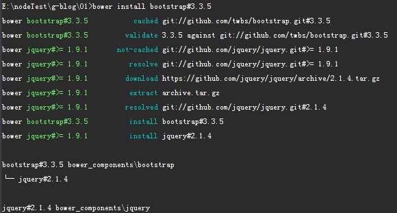
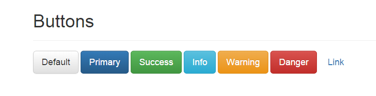

### 引入bootstrap 
 在以前的开发中使用最多的方法就是去官网下载一个想要的版本然后直接拷贝到项目中，这里我使用bower管理器([bower](http://bower.io/))
 安装方法已经在安装部分介绍了，这里就不多说了。
 
 ```
 bower install bootstrap#3.3.5
 ```
 
 如下图所示，就成功了。
 


### 为什么要使用bower呢？
只要去看看bower能做什么就知道使用bower的优势了，之间下载文件什么的，可能需要去找bootstrap依赖的jquery，然后下载bootsrap等，现在使用bower一行使用搞定，
``` 
bower -h 
```

可以看到相关的命令帮助，bower的学习成本不高，但给项目带来的好处是可见的，

### 删除bootstrap框架
``` 
bower uninstall bootstrap
```

看看文件bower_components中已经没有jquery和bootstrap了，是是很方便。
通过bower自动引入的bootstrap框架目录从官网上直接下载的有些不同，主要表现在多了一些配置文件，现在可以不用去理会。
如果想对bootstrap二次开发那需要明白这些文件有什么用比如：
* package.json(bootstrap项目包配置文件)
* bower.json(bower配置文件)
* Gruntfile.js(gruntjs配置文件)

现在我们只关心bootstrap的dist文件夹和jquery中的dist文件夹，

在01文件夹中新一个helloStrap.html文件并在header上添加以下代码：

```
<script src="../bower_components/jquery/dist/jquery.min.js"></script>
<script src="../bower_components/bootstrap/dist/js/bootstrap.min.js"></script>
<link rel="stylesheet" href="../bower_components/bootstrap/dist/css/bootstrap.min.css"/>
```

在body之间添加以下代码

```
<div class="container">
    <div class="page-header">
        <h1>Buttons</h1>
    </div>
    <p>
        <button type="button" class="btn btn-lg btn-default">Default</button>
        <button type="button" class="btn btn-lg btn-primary">Primary</button>
        <button type="button" class="btn btn-lg btn-success">Success</button>
        <button type="button" class="btn btn-lg btn-info">Info</button>
        <button type="button" class="btn btn-lg btn-warning">Warning</button>
        <button type="button" class="btn btn-lg btn-danger">Danger</button>
        <button type="button" class="btn btn-lg btn-link">Link</button>
    </p>
</div>
```

如果能看到下面这样的效果说明已经成功




