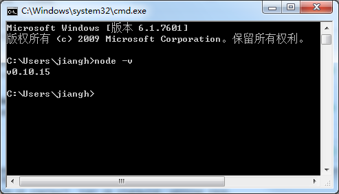

## 开发环境准备
### node.js 安装
1. 下载node.js [官网下载](http://nodejs.org/)
1. 安装方法。（在window环境中安装，就不再说明）
1. 安装成功后在command 窗口中输入 

```
node -v
```

看到下面窗口内容表示安装成功



### 掌握npm 的简单操作

1. 查看帮助

```
npm --help
```

2. 安装

```
 npm install
```

3. 删除

```
npm uninstall
```

### 安装Bower

```
npm install -g bower
```

感觉使用框架开发前端需要很多的准备工作，这些准备工作一不小心就会出错，有时出错还不容易发现，百度也可能解决不了问题，这时需要重新再来，多试几次就会成功^_^
